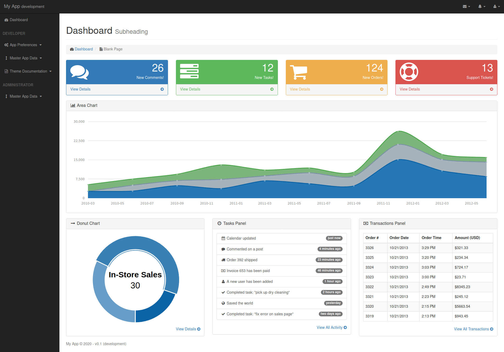
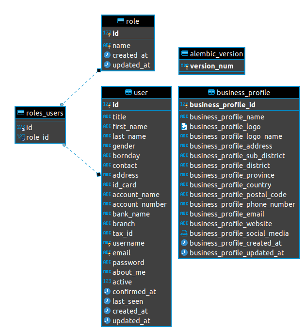

# Description

After 6 month develop apps with unstructure and random schema, this is boilerplate template with Flask, Postgres/MySQL, Docker build from scratch.

This repository will be project template for all projects with flask for minimal and flexible implementation for other projects.



# Terminology

To better communicate and more easily build API and UI, the current contibutors have decided on a collection of terminology to clarify disscusions surrounding the boilerplate flask project :


|Term|Definition|Example|
|---|---|---|
|administrator|Hak akses dari user yang dapat melakukan manajemen data master pada aplikasi|
|modul|Komponen dari suatu sistem yang berdiri sendiri, tetapi menunjang program dari sistem. Module berisikan routes, models dan views|

# User Stories

## MVP

## Post-MPV

# UI / UX Design References
+ [User Role Workflow](https://figma.com/)
+ [Prototype](https://figma.com/)

# Schema
Expand to vie a diagram illustrating the proposed schema for boilerplate-flask


# Tech Stack

We are planning to use the following tools:
+ Python / Flask for out backend
+ Postgres/MySQL with SQLAlchemy
+ Vue.js for client-side rendering for frontend
    + Bootstrap 3

# Development Setup
Requirements: Python 3.6, Docker, Internet Access

## Starting Development Server
Open terminal/bash and navigat to the directory where you want the project to live.

### Manual installation Setup
Clone this repository
```bash
$ git clone https://gitlab.com/digital-inovasi-bangsa/web/boilerplate-flask.git
```
Navigate to the newly cloned repo
```bash
$ cd boilerplate-flask
```
Create virtual environtment
```bash
$ python -m venv venv
```

Activate your local environtment
```bash
// Linux
$ source venv/bin/activate
// Windows
$ source venv/Scripts/activate
```
Install packages that requires for this projects
```bash
$ pip install -r requirements.txt
```
Copy example environtment file & add your credentials settings (SECRET_KEY, DB, etc)
```bash
$ cp .env.example .env
```
Filling SECRET_KEY with string generation using this command
```bash
$ python3 -c "import uuid; print(uuid.uuid4().hex)"
```

### Data Preparation
1. Doing initilization migration
```bash
$ flask db init
```
2. Doing migration
```bash
$ flask db migrate -m "initial migration"
```
3. Apply migration
```bash
$ flask db upgrade
```
4. Insert default data
```bash
$ flask deploy
```

### Running application
After all set, let's running our development server
```bash
$ flask run -p 8080
```

### Update Translation
This task can be perform when we change the translation
```bash
$ flask translate init id
$ flask translate update
$ flask translate compile
```

### Running local mail server (Testing Purpose Only)
If you want to testing email with localserver make sure setting you several .env variabel to :
```
...
FLASK_DEBUG=0
MAIL_SERVER=localhost
MAIL_PORT=8025
MAIL_USE_TLS=
MAIL_USERNAME=
MAIL_PASSWORD=
...
```
And then run the local mail server with this command :
```bash
$ python -m smtpd -n -c DebuggingServer localhost:8025
```


### Docker deployment 
1. build images with
```bash
$ docker build -t flask-base:tag .
```
note : tag fill with version of images. follow symantic versioning for this tag version

2. after success build, you can show the image with
```bash 
$ docker images
```

3. run flask-base app with this command
```bash
➜ docker run --name flask-base -p 8000:5000 --rm -e SECRET_KEY=my-secret-key \
-e MAIL_SERVER=smtp.googlemail.com -e MAIL_PORT=587 -e MAIL_USE_TLS=true -e MAIL_DEVELOPER=developer@dib.biz.id \
-e MAIL_USERNAME=my@mail.com -e MAIL_PASSWORD=password -e MAIL_ADMIN=admin@dib.biz.id \
-e APP_NAME='My App' -e LOG_STD_OUT=0 -e UPLOAD_FOLDER='static/uploads/' flask-base:v1.0.0.alpha
```
how to access bash for our flask-base image ? follow this command
```bash
$ docker exec -it flask-base sh
```

4. for add mysql to our apps, run this command
```bash
➜ docker run --name mysql -e MYSQL_RANDOM_ROOT_PASSWORD=yes \
➜ -e MYSQL_DATABASE=flask-base -e MYSQL_USER=flask-base \
➜ -e MYSQL_PASSWORD=letmeinplease \
➜ mysql/mysql-server:5.7
```

5. run flask-base image to connect mysql server
```bash
➜ docker run --name flask-base -p 8000:5000 --rm -e SECRET_KEY=my-secret-key \
-e MAIL_SERVER=smtp.googlemail.com -e MAIL_PORT=587 -e MAIL_USE_TLS=true -e MAIL_DEVELOPER=developer@dib.biz.id \
-e MAIL_USERNAME=my@mail.com -e MAIL_PASSWORD=password -e MAIL_ADMIN=admin@dib.biz.id \
-e APP_NAME='My App' -e LOG_STD_OUT=0 -e UPLOAD_FOLDER='static/uploads/' \
--link mysql:dbserver -e DATABASE_URL=mysql+pymysql://flask-base:<password>@dbserver/flask-base \
flask-base:v1.0.0.alpha
`
```
6. __Important!__ after build new images
makesure the name of images update for any changes, and update the name in run command

# API
You can see our full API Documentation by navigationg to [http://localhost:5000/api/v1/](http://localhost:5000/api/v1/)

# Problems
Several problem will showing with several command

### Error when create migration
```bash
$ flask db migrate -m "messages"
ERROR [root] Error: Can't locate revision identified by '89ed8ff874ae'
```
### Solution
```bash
$ flask db revision --rev-id 89ed8ff874ae
$ flask db migrate -m "messages"
$ flask db upgrade
```

# Testing
Don't forget to test the apps with this command

# Branching Strategies
This branching strategies is using [git flow](https://www.atlassian.com/git/tutorials/comparing-workflows/gitflow-workflow)

#### Create Feature
```bash
$ git checkout develop
$ git checkout -b feature_branch
// same with
$ git flow feature start feature_branch

git checkout develop
git merge feature_branch
// same with
$ git flow feature finish feature_branch
```

#### Create Release
```bash
$ git checkout develop
$ git checkout -b release/0.1.0
// same with
$ git flow release start 0.1.0

$ git checkout master 
$ git merge release/0.1.0
// same with
$ git flow release finish '0.1.0'
```

#### Create Hotfix
```bash
$ git checkout master
$ git checkout -b hotfix_branch
// same with
$ git flow hotfix start hotfix_branch

$ git checkout master
$ git merge hotfix_branch
$ git checkout develop
$ git merge hotfix_branch
$ git branch -D hotfix_branch
// same with
$ git flow hotfix finish hotfix_branch
```

# Contributing
+ You should join our mattermost to get connected and follow announcement
+ Please read the suggested steps to contibute code to the boilerplate flask project before creating issues, forking, submit any pull request

# License
Copyright © 2020 [dib.sh](https://dib.sh/)

The computer software is licensed under the Apache License 2.0 license.

# Contributors
- [dvrg](https://gitlab.com/dvrg)
